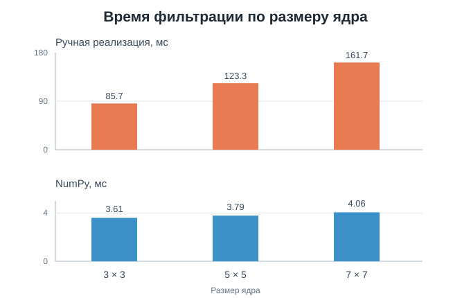

# ЛР1. Вариант 3: усредняющий фильтр Гаусса

Программа размывает изображение фильтром Гаусса с заданными размером ядра и параметром σ. Один и тот же алгоритм реализован двумя способами: с функциями NumPy и вручную на Python. Для загрузки и сохранения изображений в обоих случаях используется Pillow.

## Запуск

Требуется Python 3.10 или новее. Из папки проекта:

```bash
python -m pip install -r requirements.txt
python create_demo.py
python main.py examples/input.png --kernel-size 5 --sigma 1.2 --repeats 5
```

Результаты появятся в `output/gaussian_numpy.png` и `output/gaussian_python.png`. Вместо `examples/input.png` можно указать собственное изображение. Параметр `--output-dir` задаёт другую папку для результатов.

`--kernel-size` принимает положительное нечётное число, `--sigma` — положительное конечное число. `--repeats` задаёт число запусков каждого алгоритма при измерении времени. Программа сообщает медианное время, ускорение и наибольшее расхождение между выходными каналами.

## 1. Теоретическая база

Дискретное одномерное ядро Гаусса для смещений `i = -r, ..., r`, где `r = (k - 1) / 2`, вычисляется как `w(i) = exp(-i² / (2σ²))`. Затем все значения делятся на их сумму. Параметр `k` задаёт размер ядра, а σ определяет распределение весов: при большем σ дальние пиксели влияют сильнее.

Двумерное ядро разделимо на два одномерных. Поэтому изображение последовательно обрабатывается по горизонтали и вертикали. Для изображения шириной `W`, высотой `H` и ядра размера `k` требуется порядка `O(W·H·k)` операций вместо `O(W·H·k²)` при прямом двумерном обходе. За пределами изображения берётся ближайший граничный пиксель. Цветовые каналы RGB обрабатываются отдельно, округление до целого выполняется только после двух проходов.

## 2. Разработанная система

### `gaussian_kernel`: веса фильтра

Функция вычисляет веса по размеру ядра и σ, затем делит каждый вес на их общую сумму. Полученное ядро используется в обеих реализациях.

```python
def gaussian_kernel(size, sigma):
    radius = size // 2
    weights = []
    for offset in range(-radius, radius + 1):
        distance = abs(offset) / sigma
        weights.append(0.0 if distance > 40 else math.exp(-0.5 * distance * distance))
    total = sum(weights)
    return [weight / total for weight in weights]
```

### `blur_numpy`: библиотечная обработка

NumPy дополняет края ближайшими пикселями и применяет готовую функцию `convolve` сначала к строкам, затем к столбцам. После двух проходов значения округляются и приводятся к диапазону RGB.

```python
padded = np.pad(image, ((0, 0), (radius, radius), (0, 0)), mode="edge")
horizontal = np.apply_along_axis(lambda line: np.convolve(line, kernel, mode="valid"), 1, padded)

padded = np.pad(horizontal, ((radius, radius), (0, 0), (0, 0)), mode="edge")
vertical = np.apply_along_axis(lambda line: np.convolve(line, kernel, mode="valid"), 0, padded)
```

### `blur_python`: ручная обработка

Здесь те же два прохода выполняются циклами. В горизонтальном проходе для каждого соседнего пикселя берётся его цвет и умножается на соответствующий вес. Во втором проходе аналогично обрабатываются соседние строки. Выражение `min(max(...))` удерживает координату внутри изображения.

```python
source_x = min(max(x + index - radius, 0), width - 1)
source = pixels[y * width + source_x]
for channel in range(3):
    horizontal[y][x][channel] += source[channel] * weight
```

### `measure` и `main`: сравнение результатов

`measure` запускает переданную функцию несколько раз и возвращает результат последнего запуска и медианное время.

```python
def measure(function, repeats):
    times = []
    result = None
    for _ in range(repeats):
        start = time.perf_counter()
        result = function()
        times.append(time.perf_counter() - start)
    return result, statistics.median(times)
```

В `main` одна и та же функция измерения вызывается для двух вариантов фильтра.

```python
numpy_result, numpy_time = measure(lambda: blur_numpy(array, kernel), args.repeats)
python_result, python_time = measure(lambda: blur_python(pixels, width, height, kernel), args.repeats)
```

Затем `main` сохраняет оба изображения, сравнивает их по пикселям и выводит время и ускорение.

Время чтения файла, подготовки входных данных и записи PNG не включено в замеры: сравнивается только работа фильтра. Входное изображение приводится к RGB.

## 3. Результаты и тестирование

Демонстрационное изображение создано скриптом `create_demo.py`. Оно имеет размер 160 × 120 пикселей и содержит градиент, шум, контрастные фигуры и диагональную линию.

| Оригинал | Ядро 5 × 5, σ = 1.2, NumPy | Ядро 5 × 5, σ = 1.2, Python |
| --- | --- | --- |
|  |  |  |

Увеличение ядра и σ делает переходы мягче:

| 3 × 3, σ = 1.2 | 7 × 7, σ = 1.2 | 7 × 7, σ = 2.0 |
| --- | --- | --- |
|  |  |  |

Замеры выполнены 6 октября 2026 года на Windows, Python 3.12.14, NumPy 2.3.5 и Pillow 12.3.0. Для каждого размера ядра алгоритм запускался 9 раз; в таблице приведена медиана. Изображение и σ = 1.2 во всех трёх строках одинаковы.

| Ядро | NumPy, мс | Python, мс | Ускорение NumPy | Максимальная разница каналов |
| --- | ---: | ---: | ---: | ---: |
| 3 × 3 | 3.606 | 85.720 | 23.8 раза | 0 |
| 5 × 5 | 3.787 | 123.281 | 32.5 раза | 0 |
| 7 × 7 | 4.057 | 161.718 | 39.9 раза | 0 |



При 7 × 7 и σ = 2.0 медианное время составило 3.908 мс для NumPy и 162.321 мс для Python, максимальная разница каналов также равна нулю. Время зависит от компьютера и его нагрузки; для сравнения на другом компьютере следует повторить замеры.

Проверка `python -m unittest -v` включает нормировку и симметрию ядра, неизменность одноцветного изображения и совпадение двух реализаций на изображениях разного размера. Все три теста прошли.

## 4. Выводы

Обе реализации дают одинаковые изображения на проверенных примерах. При увеличении размера ядра время ручной реализации растёт заметнее. На демонстрационном изображении NumPy обработал данные в 24–40 раз быстрее. Разделение фильтра на два одномерных прохода позволяет менять `k` и σ независимо и сохранять приемлемое число операций.

## 5. Использованные источники

1. Техническое задание «ЛР1», файл `LW1.pdf`, предоставленный для этой работы.
2. [SciPy: описание Gaussian filter и разделения на одномерные свёртки](https://docs.scipy.org/doc/scipy/reference/generated/scipy.ndimage.gaussian_filter.html).
3. [NumPy: `convolve`](https://numpy.org/doc/stable/reference/generated/numpy.convolve.html).
4. [NumPy: `apply_along_axis`](https://numpy.org/doc/stable/reference/generated/numpy.apply_along_axis.html).
5. [Pillow: работа с файлами изображений](https://pillow.readthedocs.io/en/stable/reference/open_files.html).
